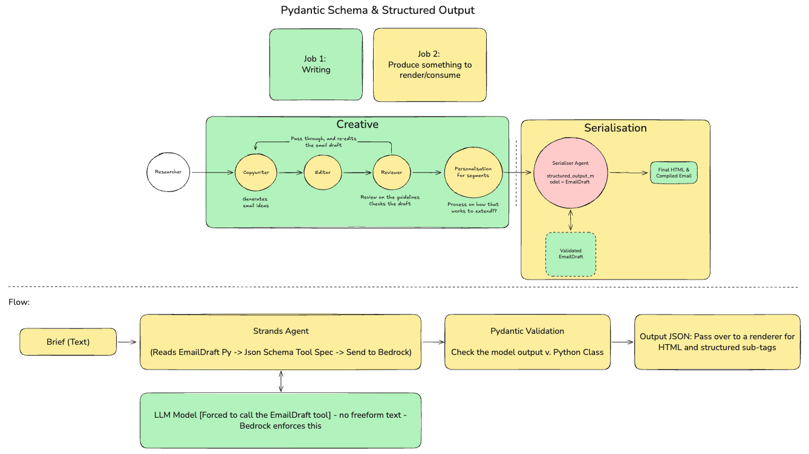
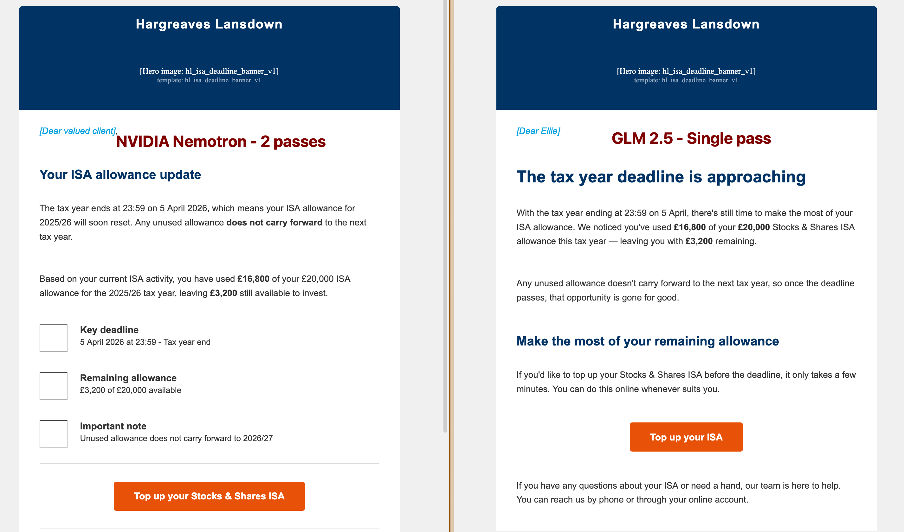
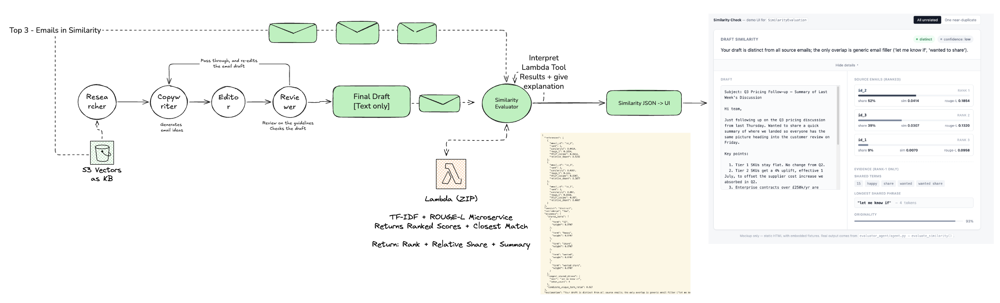
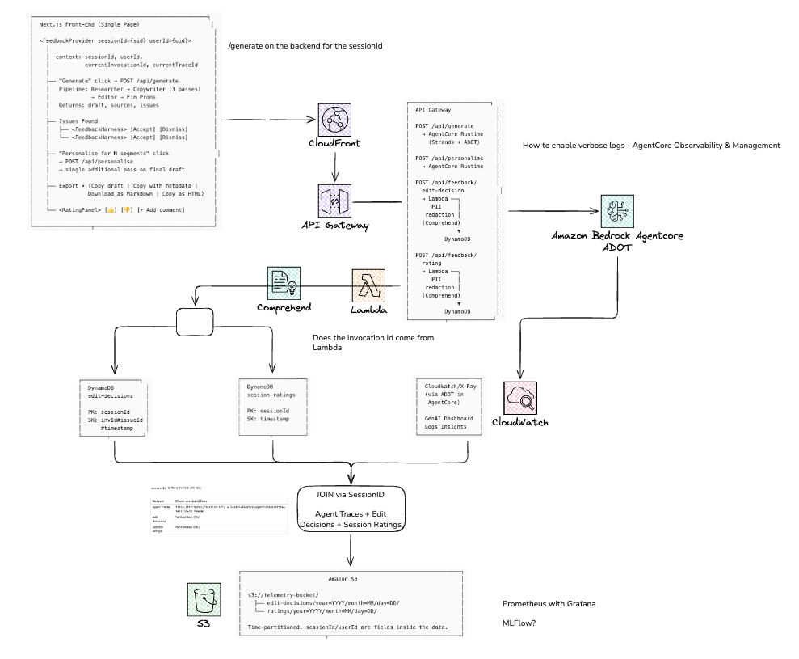

# Copycraft — AI Email Pipeline Infrastructure

**A collaboration between Hargreaves Lansdown and AWS · Financial Services Experience Based Acceleration (EBA)**

Three production-ready components built during an EBA engagement to support an agentic email copywriting platform for financial services. Each component solves a distinct problem in the pipeline — structured LLM output, content similarity scoring, and user feedback telemetry — and is independently deployable with its own CDK stack.

Built with [Strands Agents SDK](https://strandsagents.com/), Amazon Bedrock, and AWS CDK (Python).

---

## Repository Layout

```
├── structured_output_email/       Task 1 — Structured Output Email Generation
├── email_comparison_similarity/   Task 2 — Email Similarity Scoring & Evaluation
├── telemetry/                     Task 3 — Feedback Telemetry Pipeline
└── design.md                      Product design document (customer-owned)
```

---

## Task 1 — Structured Output Email Generation

**Problem:** LLMs produce free-form HTML that renderers can't reliably style, diff, or annotate. In a regulated financial services context, every block of an email needs to be individually reviewable for compliance — you can't do that with a blob of HTML.

**Solution:** A Pydantic-defined block schema (`EmailDraft`) that the LLM is forced to emit via Strands' structured output feature. The model produces a typed tree of content blocks (hero, heading, paragraph, CTA, disclaimer, Liquid macros, etc.), and a deterministic renderer turns that tree into email-client-safe HTML with brand chrome applied at compile time.

### Architecture



### Key Design Decisions

- **Schema as the contract.** `email_blocks_schema.py` is the single source of truth. JSON Schema and TypeScript types are generated from it — never hand-maintained. The schema uses `ConfigDict(extra="forbid")` on every model to prevent the LLM from inventing undocumented fields.
- **Structured output on the final pass only.** Interior agents (Copywriter → Editor → PR Review) stream free-form prose for a responsive UX. Only the final serialiser pass binds the `EmailDraft` schema. This avoids the ~13 KB tool-spec overhead on every invocation, keeps token-level convergence diffs working, and lets the Editor reason about words rather than block trees.
- **Discriminated union with no recursion.** Block types use a `type` discriminator for clean routing. `ColumnLayoutBlock` cannot nest inside itself — this avoids a `RecursionError` in Strands' `$ref` inliner and is also a desirable invariant (nested column tables render poorly in Outlook).
- **Inline Liquid for personalisation.** Merge tags live inside paragraph HTML as `<span data-liquid-tag="...">` nodes. The renderer substitutes raw Liquid at export and a preview label in the editor. No data-driven merge in content — personas are prompt overlays that produce parallel drafts.

### What's Included

| Component | Description |
|---|---|
| `schema/email_blocks_schema.py` | 11 block types, annotations, draft metadata — the canonical Pydantic schema |
| `agent/strands-structured-output.py` | Strands agent that takes a creative brief and emits a validated `EmailDraft` |
| `renderer/render_email.py` | Block walker that produces inline-styled HTML with HL brand chrome |
| `pipeline.py` | End-to-end runner: Brief → Agent → JSON → Renderer → HTML (opens in browser) |
| `schema/email-blocks-v1-design-proposal.md` | Full design proposal with linked architectural decisions |
| `docs/structured-output-guide.md` | Walkthrough of Strands structured output mechanics, gotchas, and pipeline placement rationale |
| `samples/` | Generated JSON drafts, rendered HTML, and model comparison screenshots |

### Model Comparison

Tested across multiple Bedrock models (Nemotron 3 Super 120B, GLM 5, Claude Sonnet) to validate schema adherence and output quality across providers.



### Running It

```bash
cd structured_output_email

# Full pipeline: generate draft + render HTML
python3 pipeline.py

# Agent only (stop after JSON generation)
python3 pipeline.py --agent-only

# Render only (re-render existing draft)
python3 pipeline.py --render-only

# Swap model without code changes
BEDROCK_MODEL_ID=zai.glm-5 BEDROCK_REGION=eu-west-2 python3 pipeline.py
```

---

## Task 2 — Email Similarity Scoring & Evaluation

**Problem:** When an AI generates email copy from source material retrieved via RAG, how derivative is the output? Copywriters need an informational signal — not a gate — that tells them whether their draft is distinct from, related to, or a near-duplicate of the source emails it was written from.

**Solution:** A two-tier architecture: a stateless Lambda that computes deterministic TF-IDF cosine + ROUGE-L scores with structured evidence, and a Strands evaluator agent that reads those scores and writes a single human-readable sentence explaining the relationship.

### Architecture



### Key Design Decisions

- **Deterministic scoring, LLM explanation.** The Lambda produces all numbers, verdicts, and evidence. The LLM writes exactly one field: `explanation`. This is enforced structurally — the LLM receives a single-field `ExplanationOnly` schema and physically cannot overwrite scores or verdicts.
- **No Strands `@tool` for the Lambda call.** The agent calls the Lambda in code and passes the full JSON response into the LLM prompt. This avoids tool-call loops that some models (including Nemotron 3 Super) fall into when combining tools with structured output. Simpler, faster, more predictable.
- **TF-IDF over BERTScore.** The original design proposed BERTScore (transformer-based semantic similarity). We replaced it with TF-IDF cosine + ROUGE-L because: no GPU/large container needed (~5 MB zip vs ~2 GB image), sub-50ms warm latency, $0 at rest, and the evidence block (shared terms, longest contiguous phrase, uniqueness ratio) is directly interpretable — every field traces back to the same vector space that produced the headline score.
- **Three-tier verdict + confidence.** `verdict` (distinct/related/near_duplicate) answers "how close is it?" from absolute thresholds. `confidence` (low/medium/high) answers "how decisive is the ranking?" from the gap between rank-1 and rank-2. They answer different questions and can legitimately disagree.
- **Informational only.** The pipeline does not gate on similarity, does not trigger rewrites, does not flag for human review. The copywriter sees the result and decides what to do.

### What's Included

| Component | Description |
|---|---|
| `lambda/handler.py` | TF-IDF + ROUGE-L scoring with evidence extraction (~500 lines, no model calls) |
| `evaluator_agent/agent.py` | Strands agent: calls Lambda, gets LLM explanation, merges into typed `SimilarityEvaluation` |
| `evaluator_agent/schemas.py` | Pydantic models: `Reference`, `Evidence`, `ExplanationOnly`, `SimilarityEvaluation` |
| `evaluator_agent/config.py` | Model selection, region, system prompt — swap Nemotron ↔ GLM in one line |
| `evaluator_agent/similarity_client.py` | Lambda invoker with local/live mode switching |
| `infra/stacks/similarity_stack.py` | CDK stack: zip-packaged Lambda with Docker-based bundling for numpy/scipy wheels |
| `local_test/run_test.py` | Lambda-only smoke test (no agent, no LLM) |
| `demo_ui/index.html` | Single-page demo UI for visualising similarity results |
| `fixtures/` | Shared test emails (candidate + references) — single source of truth for both runners |
| `PLAN.md` | Full architecture decisions, response schema, integration contract |
| `SYNTHESIS.md` | Decision trail from BERTScore proposal to TF-IDF design |

### Running It

```bash
cd email_comparison_similarity/evaluator_agent

# Mock mode — no AWS creds needed, deterministic templated explanation
python run_local.py | jq .

# Live LLM — Bedrock Nemotron 3 Super in eu-west-2
python run_local.py --live-llm | jq .

# Full live — deployed Lambda + Bedrock
python run_local.py --live-llm --live-lambda | jq .
```

### Deploying the Lambda

```bash
cd email_comparison_similarity/infra
python3 -m venv .venv && source .venv/bin/activate
pip install -r requirements.txt
cdk deploy
```

### Cost Profile

| Usage | Monthly cost (Lambda + Bedrock) |
|---|---|
| 100 invocations | ~$0.01 |
| 1,000 invocations | ~$0.10 |
| 10,000 invocations | ~$1.00 |

$0 at rest. No provisioned concurrency, no always-on infrastructure.

---

## Task 3 — Feedback Telemetry Pipeline

**Problem:** All user feedback (thumbs up/down, annotation accept/dismiss) was localStorage-only. No backend telemetry existed. Agent traces weren't exported. There was no way to correlate user satisfaction with agent performance.

**Solution:** An end-to-end telemetry pipeline: S3 for feedback data (write-and-forget analytics), a single Lambda with PII redaction via Amazon Comprehend, API Gateway for the feedback endpoints, and ADOT on AgentCore for agent trace export to CloudWatch/X-Ray.

### Architecture



### Key Design Decisions

- **S3, not DynamoDB.** Feedback is write-and-forget analytics data, not read-back application state. Time-partitioned JSON files in S3 (`year=YYYY/month=MM/day=DD/`) are queryable via Athena when needed, with no table design or capacity planning.
- **Single Lambda, two routes.** Both `/api/feedback/edit-decision` and `/api/feedback/rating` do the same thing: validate → PII redact → write JSON to S3. Only the prefix and key pattern differ. One deployment unit, one log group, DRY.
- **PII redaction before storage.** User comments, issue text, and suggestions can contain names, emails, and addresses from the email copy. Amazon Comprehend's `DetectPiiEntities` redacts these in the Lambda before the S3 write. IAM permissions are pre-granted; the redaction call is stubbed for Phase 1 and wired in Phase 2.
- **`sessionId` as the universal join key.** Agent traces (via `trace_attributes["session.id"]`), edit decisions (JSON field + S3 filename), and session ratings all share `sessionId`. Correlating user satisfaction with agent performance is a single Athena/Logs Insights join.
- **Optional Cognito auth.** The CDK stack accepts an optional `user_pool` parameter. When provided, both feedback routes require a valid Cognito JWT. When omitted (dev default), routes are open. Production deployments must pass a user pool.

### What's Included

| Component | Description |
|---|---|
| `lambda/feedback/handler.py` | Single Lambda handler routing by API Gateway `resource` field |
| `lambda/feedback/test_handler.py` | Unit tests with mocked S3 (pytest) |
| `infra/stacks/telemetry_stack.py` | CDK stack: S3 bucket (SSE, lifecycle rules) + Lambda + REST API Gateway + optional Cognito auth |
| `infra/app.py` | CDK app entry point |
| `documentation/README.md` | Full system design: application flow, component structure, S3 schemas, OTEL setup, PII protection |
| `documentation/contracts.md` | Interface contracts for backend OTEL, feedback APIs, frontend types, CDK resources |
| `documentation/PLAN.md` | Implementation plan with phased build steps |
| `documentation/contract-conflicts.md` | Tracked deviations between contracts and implementation |
| `documentation/TESTING.md` | Test strategy and verification steps |

### Data Flow

```
User action (Accept/Dismiss/Rate)
    → Next.js FeedbackProvider
        → API Gateway (POST /api/feedback/*)
            → Lambda (PII redaction via Comprehend)
                → S3 (time-partitioned JSON)

Agent execution
    → Strands SDK (auto-instrumented spans)
        → ADOT on AgentCore
            → CloudWatch / X-Ray (GenAI Dashboard, Logs Insights)
```

### Deploying

```bash
cd telemetry/infra
python3 -m venv .venv && source .venv/bin/activate
pip install -r requirements.txt
cdk deploy
```

---

## Technology Stack

| Layer | Technology |
|---|---|
| AI Framework | [Strands Agents SDK](https://strandsagents.com/) |
| Foundation Models | Amazon Bedrock (Claude Sonnet, Nemotron 3 Super 120B, GLM 5) |
| Infrastructure | AWS CDK (Python) |
| Compute | AWS Lambda (Python 3.12) |
| Storage | Amazon S3 |
| API | Amazon API Gateway (REST) |
| Observability | AWS Distro for OpenTelemetry (ADOT), CloudWatch, X-Ray |
| PII Protection | Amazon Comprehend |
| Auth | Amazon Cognito (optional) |
| Schema Validation | Pydantic v2 |
| NLP Scoring | scikit-learn (TF-IDF), rouge-score |

## Prerequisites

- Python 3.12+
- AWS CDK v2 CLI (`npm install -g aws-cdk`)
- AWS credentials configured for the target account
- Docker (for Lambda bundling in the similarity stack)
- Bedrock model access in `eu-west-2` (for live LLM modes)

## Licence

Internal — Hargreaves Lansdown / AWS EBA engagement.
