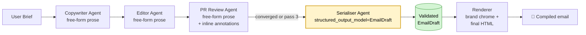
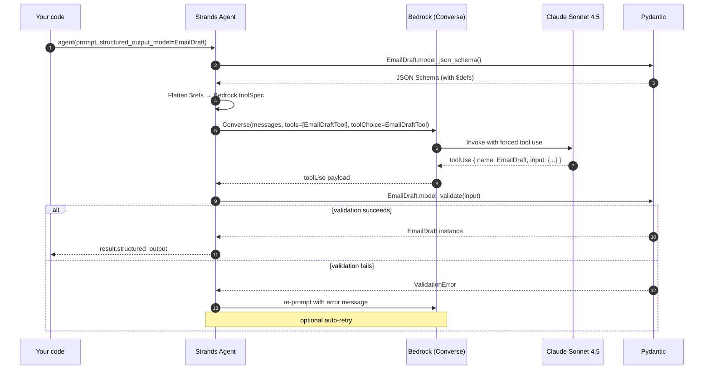
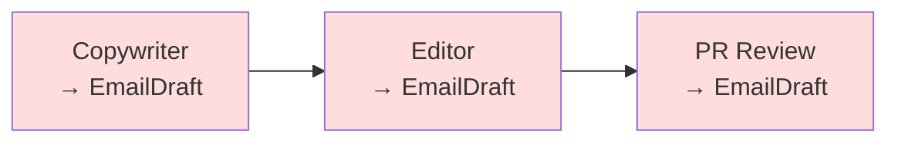
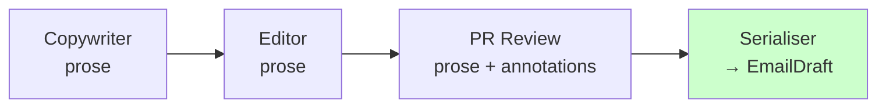
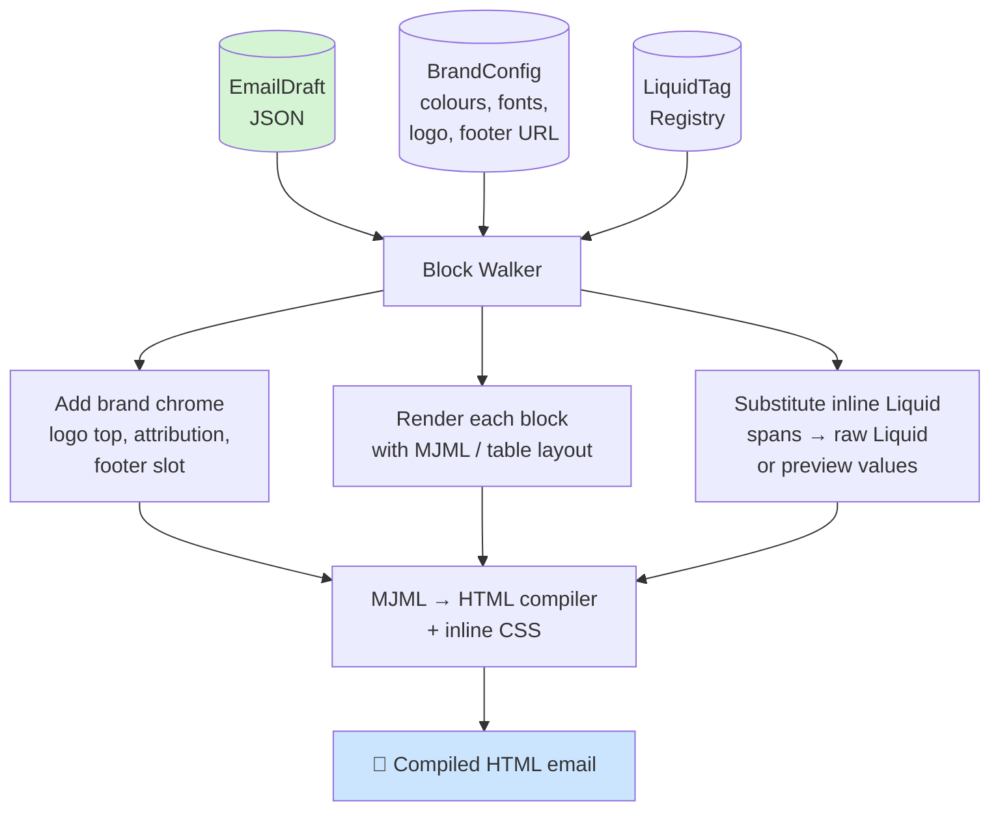

# Structured Output with Strands Agents

**A walkthrough of how we produce type-safe, validated `EmailDraft` objects from an LLM — and where to place that in an agentic copywriting pipeline.**

---

## What you'll learn

1. Why structured output exists, and what it actually does under the hood
2. How to wire a Pydantic schema into a Strands agent
3. Why you should bind the schema at the **final pass** only, not every agent hop
4. How the block-based output gets post-formatted into real email HTML
5. A couple of gotchas we hit on the way (schema recursion, model legacy gates)

---

## The big idea

A "copywriting agent" has two jobs that fight each other:

- **Job 1 — Write well.** Generate natural, brand-aligned prose.
- **Job 2 — Produce something a renderer can consume.** Emit a tree of typed blocks with unique IDs, variants, and metadata.

If you let the LLM write HTML directly, it will produce something pretty that your renderer can't style, measure, or diff. If you force structured output on *every* hop, you lose the streaming UX and pay a tool-spec tax on every invocation.

The answer is to split the pipeline into two halves:

- **Creative half** — free-form prose, streamed token-by-token, no schema.
- **Serialisation half** — one final agent pass that binds the canonical `EmailDraft` schema and produces validated output.



The yellow node is the only one that speaks schema. Everything before it is prose.

---

## How Strands structured output works under the hood

From the Strands docs: *"The agent converts your schema into a tool specification that guides the language model to produce correctly formatted responses, then validates the output automatically."*

In plain terms:

1. You hand Strands a Pydantic model (`EmailDraft`).
2. Strands calls `EmailDraft.model_json_schema()` internally, flattens `$ref`s, and wraps it as a Bedrock `toolSpec`.
3. The model is forced to "call" that tool with a payload matching the schema — Bedrock's tool-use feature enforces this at the protocol level. Free-form text is off the table.
4. Strands validates the tool input against the Pydantic model. Validators fire, `extra="forbid"` is enforced, types are coerced.
5. On success you get a typed `EmailDraft` instance. On failure Strands raises `StructuredOutputException` (which you can handle with a retry).



Two things worth noticing:

- **The system prompt is advisory, not authoritative.** The schema is what constrains output; the prompt is what constrains *quality*. Don't duplicate field names in your prompt — the schema already has them. Use the prompt for intent, tone, and domain rules.
- **Validation is real.** Pydantic `field_validator`s run, `HttpUrl` is parsed, bounds like `min_length`/`max_length` are enforced. This is why your `subject: str = Field(min_length=1, max_length=150)` constraint in `email_blocks_schema.py` actually bites the model.

---

## Files in this project

```
email_files_HL/
├── email_blocks_schema.py            # ← the Pydantic schema (source of truth)
├── email-blocks-schema.json          # generated JSON Schema (for TS codegen)
├── email-blocks-schema.ts            # generated TypeScript types (for the editor)
├── email-draft-sample-isa-deadline.json  # hand-authored reference sample
├── strands-structured-output.py      # ← the Strands runner (what we built)
└── email-draft-generated.json        # output from running the runner
```

The schema lives in **one place** — `email_blocks_schema.py`. Everything else is derived:

- `email-blocks-schema.json` via `EmailDraft.model_json_schema()`
- `email-blocks-schema.ts` via `json-schema-to-typescript` codegen
- `email-draft-generated.json` via Strands

Never hand-edit the JSON or TS files. Regenerate when the Pydantic model changes.

---

## Setup

### Prerequisites

```bash
pip install 'strands-agents>=1.37' pydantic
```

Why `>=1.37`? That's the version that introduced the modern `structured_output_model=` parameter on `Agent(...)`. Older versions (we hit this on 1.7.0) only have the deprecated `agent.structured_output(Model, prompt)` method.

### AWS credentials

You need Bedrock access in a region that hosts the inference profile you're targeting. For HL we're using the EU cross-region profile for Claude Sonnet 4.5:

```
eu.anthropic.claude-sonnet-4-5-20250929-v1:0   (region: eu-west-1)
```

Verify access before wiring it into Strands:

```bash
aws bedrock-runtime converse \
  --region eu-west-1 \
  --model-id eu.anthropic.claude-sonnet-4-5-20250929-v1:0 \
  --messages '[{"role":"user","content":[{"text":"ping"}]}]' \
  --inference-config '{"maxTokens":10}'
```

If you get a `ResourceNotFoundException` with the phrase *"you have not been actively using the model in the last 30 days"*, pick a different inference profile — AWS gates recency on some models. List active profiles:

```bash
aws bedrock list-inference-profiles \
  --region eu-west-1 \
  --type-equals SYSTEM_DEFINED \
  --query 'inferenceProfileSummaries[?status==`ACTIVE`].[inferenceProfileId]' \
  --output text
```

---

## The schema

`email_blocks_schema.py` is the contract. A few design rules worth calling out:

| Rule | Why |
|---|---|
| `model_config = ConfigDict(extra="forbid")` on every model | Prevents the model from "helpfully" adding undocumented fields. |
| Discriminated union on `type` | Lets Pydantic route each block to the correct class. Matches the `oneOf` + `discriminator` in JSON Schema. |
| `HttpUrl` for CTAs and icons | Validates the URL at parse time — no more `"www.hl.co.uk"` without scheme. |
| `alias="pass"` on `DraftMetadata.pass_` | `pass` is a Python keyword. The schema sees `pass` (what we want); we handle the alias on dump. |
| **No recursion** in `ColumnDefinition.blocks` | See gotcha #1 below. |

### Gotcha #1 — Schema recursion

The original schema allowed `column_layout` inside another `column_layout` (via `AuthoredBlock` → `ColumnLayoutBlock` → `ColumnDefinition.blocks: List[AuthoredBlock]`). Strands' converter inlines `$ref`s without cycle detection and blows the stack:

```
RecursionError: maximum recursion depth exceeded
  File ".../structured_output_utils.py", line 161, in _process_property
    result[key] = _process_nested_dict(value, defs)
```

We fixed it by splitting the union in two:

```python
# Top-level blocks — can include column_layout
AuthoredBlock = Annotated[Union[HeroBlock, ..., ColumnLayoutBlock, ...], Field(discriminator="type")]

# Blocks *inside* a column — everything except column_layout
ColumnContentBlock = Annotated[Union[HeroBlock, HeadingBlock, ...], Field(discriminator="type")]

class ColumnDefinition(BaseModel):
    width_pct: int = Field(ge=10, le=90)
    blocks: List["ColumnContentBlock"]   # ← not AuthoredBlock
```

Bonus: this is also a desirable invariant. Nested column tables render poorly in Outlook. "No columns in columns" is a good rule regardless of the Strands limitation.

---

## The runner

`strands-structured-output.py` is ~200 lines. The interesting parts:

### 1. Pick a model

```python
from strands import Agent
from strands.models import BedrockModel

BEDROCK_MODEL_ID = os.getenv(
    "BEDROCK_MODEL_ID",
    "eu.anthropic.claude-sonnet-4-5-20250929-v1:0",
)
BEDROCK_REGION = os.getenv("BEDROCK_REGION", "eu-west-1")

def _build_model() -> BedrockModel:
    return BedrockModel(model_id=BEDROCK_MODEL_ID, region_name=BEDROCK_REGION)
```

Env vars let you swap models (Haiku for cheap tests, Opus for the PR Review agent) without code changes.

### 2. Write a schema-light system prompt

The prompt does *not* describe field names. Strands sends the JSON Schema to the model as a tool spec — the field names are already there. The prompt's job is intent:

```python
SYSTEM_PROMPT = """\
You are Copycraft, Hargreaves Lansdown's email copywriter.

You author emails as a STRUCTURED TREE OF BLOCKS, not as raw HTML. The
renderer adds brand chrome (logo, footer, colours, spacing) at compile time.

Authoring rules:
  - Choose the right block type for each section: hero, heading, paragraph, ...
  - Put narrative copy in `paragraph` blocks. Put rich text in `html` as
    sanitised TipTap output — <p>, <strong>, <em>, <a>, <ul>, <ol>, <li>.
  - For salutations, embed Liquid as:
        <span data-liquid-tag="<tag_id>">[Label]</span>
  ...
"""
```

Keep this short. Every token in the system prompt costs on every invocation.

### 3. Bind the schema at the agent

```python
agent = Agent(
    model=_build_model(),
    system_prompt=SYSTEM_PROMPT,
    structured_output_model=EmailDraft,   # ← the magic
)

result = agent(BRIEF)
draft: EmailDraft = result.structured_output
```

That's it. `result.structured_output` is a typed `EmailDraft` — your IDE autocompletes on it.

### 4. Dump with aliases

```python
out_path.write_text(
    json.dumps(draft.model_dump(by_alias=True, mode="json"), indent=2),
    encoding="utf-8",
)
```

`by_alias=True` is needed because `DraftMetadata.pass_` is aliased to `pass`. `mode="json"` converts `HttpUrl` and any other Pydantic-specific types to plain JSON strings.

---

## Placement: why the final pass, not every pass

Your existing design (see `design.md`) runs **Copywriter → Editor → PR Review** for up to 3 passes. There are two places you could bind the schema:

### Option A — Structured output on every agent, every pass



### Option B — Structured output on the final serialiser only



**Option B is better, for five concrete reasons:**

| Concern | Option A (every pass) | Option B (final only) |
|---|---|---|
| **Streaming UX** | Each agent emits a structured blob. The UI can't show token-by-token prose streaming — you either show a spinner or render a half-built block tree that flickers. | Interior agents stream prose naturally. The UI shows tokens as they arrive (AG-UI `text_message_chunk`). Only the serialiser pauses briefly at the end. |
| **Cost** | Every invocation sends the full `EmailDraft` JSON Schema as a tool spec (~13 KB). 3 agents × 3 passes = 9× schema overhead. | Schema travels once, at the end. |
| **Latency** | Tool-use mode is noticeably slower than free-form generation on large schemas — the model has to serialise the full tree each time. | Interior passes stay fast and streamy. Only the final serialiser eats the structured-output latency tax. |
| **Convergence diffs** | Token-level diff between passes is impossible because you're comparing block trees, not prose. `CP-3` in your design ("token diff < 5% → converged") doesn't apply. | Token diff works as designed. Convergence logic stays clean. |
| **Editor ergonomics for the Editor agent** | The Editor sees a tree, not sentences. Rewriting a `ParagraphBlock.html` means re-parsing and re-emitting the whole envelope. High risk of breaking block IDs or metadata. | The Editor rewrites prose. Period. The serialiser worries about IDs and metadata. |

**When Option A might make sense:** if the Editor or PR Review agent *genuinely needs* to reason about block structure — e.g. "this CTA is too far from the hero, move it up" or "add a `feature_row` between blocks 3 and 4". That's a structural critique, not a copy critique, and it's rare in practice. Most editorial feedback is about words.

### The serialiser agent

It's a separate agent invocation, same container, same model. Something like:

```python
# After the Copywriter/Editor/PR Review loop has converged:
SERIALISER_PROMPT = """\
You are a serialiser. You do not write new copy. You take the agreed-upon
email text (prose, headings, CTA) and the PR Review annotations, and you
emit a canonical EmailDraft.

Rules:
  - Preserve every word of the agreed prose.
  - Assign deterministic, human-readable block IDs (blk_hero_01, blk_para_01, ...)
  - Map PR Review findings into the `annotations` array with source='compliance'.
  - Set metadata.converged=True and metadata.pass to the final pass number.
  - Include the HL liquid_macro footer block at the end.
"""

serialiser = Agent(
    model=_build_model(),
    system_prompt=SERIALISER_PROMPT,
    structured_output_model=EmailDraft,
)

final_draft = serialiser(
    f"Agreed prose:\n{prose}\n\nAnnotations:\n{annotations}"
).structured_output
```

The serialiser's job is narrow and mechanical. That makes it cheap, reliable, and easy to evaluate.

---

## What this means for the output

You get a validated `EmailDraft` with:

- `subject`, `pre_header` — bounded strings, ready for inbox rendering
- `blocks` — a typed list of the 10 block types, each with unique IDs
- `annotations` — machine-readable review findings
- `metadata` — pass count, convergence flag, word count

From our real run (`email-draft-generated.json`):

```
subject    : You have £3,200 left to use – ISA deadline is 5 April
pre_header : Your unused ISA allowance won't carry forward. Top up before ...
blocks     : 16 blocks
             [hero, paragraph, heading, paragraph, paragraph, heading,
              paragraph, paragraph, cta, divider, heading, paragraph,
              paragraph, spacer, disclaimer, liquid_macro]
annotations: 0
metadata   : pass=1, converged=true, word_count=287, tone='warm, professional, action-oriented'
```

This is the input to the renderer, not the email itself.

---

## Post-formatting: from EmailDraft to compiled HTML

The `EmailDraft` is an **intermediate representation (IR)**. The renderer walks the block tree and produces email-client-safe HTML using the `BrandConfig`.



### The three things the renderer adds that are NOT in the schema

1. **Brand chrome** — top logo, bottom regulatory attribution, HL colour palette, font stack. All brand-driven. The LLM never sees these.
2. **Layout mechanics** — table-based layouts for Outlook compatibility, MSO conditionals, VML for rounded buttons. All renderer concerns.
3. **Liquid substitution** — two modes:
   - **Editor preview mode:** `<span data-liquid-tag="hl_salutation">[Salutation]</span>` stays as-is, with the `[Salutation]` label visible.
   - **Export mode:** the span is replaced with raw Liquid like `{{ subscriber.first_name | default: 'there' }}` for Braze/the ESP to resolve at send time.

### The three things the renderer does NOT touch

1. The words. Prose in `ParagraphBlock.html` is final. The renderer sanitises but never rewrites.
2. Block order. The array order in `blocks` is the DOM order.
3. Annotations. Those are for the editor UI, not the recipient's inbox.

### Sketch of a block walker

```python
def render(draft: EmailDraft, brand: BrandConfig) -> str:
    mjml_parts = [render_brand_header(brand)]

    for block in draft.blocks:
        match block.type:
            case "hero":       mjml_parts.append(render_hero(block, brand))
            case "heading":    mjml_parts.append(render_heading(block, brand))
            case "paragraph":  mjml_parts.append(render_paragraph(block, brand))
            case "cta":        mjml_parts.append(render_cta(block, brand))
            case "disclaimer": mjml_parts.append(render_disclaimer(block, brand))
            case "liquid_macro":
                mjml_parts.append(block.expression)  # raw Liquid passthrough
            # ...

    mjml_parts.append(render_brand_footer(brand))
    mjml = "\n".join(mjml_parts)
    return mjml_to_html(mjml)   # MJML compiler → Outlook-safe HTML
```

The point: the **LLM's job ends at `EmailDraft`**. The renderer is deterministic, testable, and has nothing to do with AI. You can unit-test it with synthetic fixtures, snapshot-test its output, and evolve the brand without ever re-running the model.

---

## Running the proof of concept

```bash
# Sync mode — simplest
python3 strands-structured-output.py

# Streaming mode — closer to what your AgentCore container will do
MODE=stream python3 strands-structured-output.py

# Swap the model without touching code
BEDROCK_MODEL_ID=eu.anthropic.claude-haiku-4-5-20251001-v1:0 \
    python3 strands-structured-output.py
```

Output goes to `email-draft-generated.json`. Diff it against `email-draft-sample-isa-deadline.json` to see how close the model gets to the hand-authored reference.

---

## Gotchas we hit, in order

1. **`Agent.__init__() got an unexpected keyword argument 'structured_output_model'`** — you're on a Strands version older than 1.37. Upgrade: `pip install -U 'strands-agents>=1.37'`.
2. **`RecursionError: maximum recursion depth exceeded` in `structured_output_utils.py`** — your schema has a `$ref` cycle. Break it by splitting the discriminated union (see Gotcha #1 above).
3. **`ResourceNotFoundException: ... marked by provider as Legacy and you have not been actively using the model in the last 30 days`** — you haven't called this model in 30 days and AWS has rotated your access. Pick a different active inference profile.
4. **`StructuredOutputException`** at runtime — the model emitted something that failed Pydantic validation. Strands' default retry usually fixes this; if it doesn't, inspect the exception's `__cause__` to see the `ValidationError` and tighten your prompt or relax the schema.

---

## Recap

- Structured output = Pydantic schema → Bedrock tool spec → forced tool use → validated object.
- Put it at the **final serialiser pass only**. Keep the creative agents streaming prose.
- The schema is the contract between LLM and renderer. The LLM writes words; the renderer writes HTML.
- One file (`email_blocks_schema.py`) is the source of truth. JSON Schema and TypeScript types are generated from it.
- Break `$ref` cycles, pin to Strands ≥ 1.37, pin to an ACTIVE inference profile. That's most of the battle.
